Course Structure:
  1. [Introduction, History and Research Methods](#module1)
  2. [Behavioural Neuroscience I](#module2)
  3. [Behavioural Neuroscience II](#module3)
  4. [Developmental Psychology I](#module4)
  5. [Developmental Psychology II](#module5)
  6. [Cognitive Psychology I](#module6)
  7. [Cognitive Psychology II](#module7)
  8. [Clinical Psychology I](#module8)
  9. [Clinical Psychology II](#module9)
  10. [Social Psychology I](#module10)
  11. [Social Psychology II](#module11)
  12. [Applications of Psychology](#module12)

----------

Cues:
- [Lecture 01: Introduction, History, and Research Methods](#1)
    - [What is Psychology?](#1a)
    - [History of Psychology](#1b)
        - [The Three Beginnings of Psychology](#1b1)
        - [The Psychiatric Tradition](#1b2)
        - [The Testing Tradition](#1b3)
        - [The Academic Tradition](#1b4)
        - [Three New Beginnings of Psychology](#1b5)
    - [Research Methodology](#1c)
        - [Basic Philosophy of Science](#1c1)
        - [Ways of Doing Research](#1c2)
        - [Research Methods - Surveys & Establishing Representatives](#1c3)
        - [Correlation Is Not Causation: How Do You Establish Causation?](#1c4)
- [Lecture 02: Behavioural Neuroscience I](#2)
    - [The Nervous System and the Brain - The Big Picture](#2a)
    - [Neuron](#2b)
        - [The Neuron](#2b1)
        - [Neurotransmitters](#2b2)
        - [How Drugs Affect Neurotransmitters](#2b3)
    - [Divisions of the Nervous System](#2c)
        - [The Peripheral Nervous System](#2c1)
        - [The Central Nervous System](#2c2)
        - [How the Spinal Cord Controls Reflexes](#2c3)
        - [The Brain](#2c4)
    - [The Endocrine System](#2d)
    - [Putting It All Together - The Case of Hunger](#2e)
    - [Overarching Principles](#2f)
- [Lecture 03: Behavioural Neuroscience II](#3)
    - [The Senses](#3a)
        - [Vision](#3a1)
        - [Hearing](#3a2)
        - [The Other Senses: Taste, Smell, Touch, Pain, and Balance](#3a3)
    - [Focus on University of Waterloo Research – Synaesthesia](#3b)
    - [Coordination of Language in the Brain](#3c)
    - [Brain Coordination While We Sleep](#3d)
- [Lecture 04: Developmental Psychology I](#4)
    - [What is Behaviourism?](#4a)
    - [Classical Conditioning](#4b)
    - [Operant Conditioning](#4c)
    - [Language Acquisition](#4d)
    - [Observational Learning](#4e)
    - [The Big Picture: The Fundamental Issues Being Addressed](#4f)
- [Lecture 05: Developmental Psychology II](#5)
- [Lecture 06: Cognitive Psychology I](#6)
- [Lecture 07: Cognitive Psychology II](#7)
- [Lecture 08: Clinical Psychology I](#8)
- [Lecture 09: Clinical Psychology II](#9)
- [Lecture 10: Social Psychology I](#10)
- [Lecture 11: Social Psychology II](#11)
- [Lecture 12: Applications of Psychology](#12)

----------

# Lecture 01: Introduction, History, and Research Methods

## What is Psychology?

- 5 core courses of psychology (that the structure of this course):
    - Behavioral neuroscience
    - Developmental psychology
    - Cognitive psychology
    - Clinical psychology
    - Social psychology

- What psychology isn't?
    - Psychoanalysis: within clinical psychology, virtually no one is doing psychoanalysis anymore
    - Common Sense:
        - example: same people or opposite people attract
    - Torture of animals or people:
        - Some animals were sacrificed, but this is still consider ethical
- Psychology is hard to define, because people are hard to define
    - A way to think about psychology:
        - it has to do with what people think; it's about the **thoughts** that are in our heads
            - Historically, "thoughts" should not be part of psychology
        - our emotions, motivations, (or **feeling**) are not always the same as our thoughts, are not always captured by our thoughts
            - you can have reactions without thoughts that correspond with them
        - Psychology is also about **behavior** - how you act
        - They don't usually go together

## History of Psychology

### The Three Beginnings of Psychology

- First psychologist: Freud
    - the **psychiatric** tradition in psychology
    - started psychoanalysis
        - nowadays represented more in medicine than in psychology
    - psychiatrists really have no training in psychology
    - he didn't write his first major work "The Interpretation of Dreams" until 1898
- **Testing tradition**
    - seen most heavily in the study of intelligence Testing
    - developed in England
    - one of the key players was Sir Francis Galton, a first cousin of Charles Darwin
    - heavy biological influence on much of the test tradition still somewhat represented particularly in the evolutionary side of psychology
    - narrowest of the three traditions
    - Galton started his work in the 1870s

- **Academic Approach** (Laboratory Psychology)
    - Wilhelm Wundt
        - set up the first psychology laboratory
        - Wundt is interesting partly for his failure
        - he wanted to have a clearly scientific approach
        - he believed that thoughts could be divided into mental atoms
    - 3 reactions to Wundt
        - William James
            - a student of Wundt's and a contemporary of Freud's
            - made a log of progress and in many ways made a very important contribution
            - brought psychology to North America
        - John B. Watson
            - one of the early proponents of behaviourism
        - Gestalt psychologists in Europe

### The Psychiatric Tradition

- Major Theorists of Psychiatric Tradition
    - Freud
        - psychiatric tradition is dominated by Freud
        - had a very complex theory about the way the psyche worked
        - two **primary motives** that drive people: **sex and aggression**
        - much of what drives our behaviour is **unconscious**
        - huge inner mental life that we are unaware of which is very complex and very devious
        - (some are wacky, like the following)
        - Oedipus complex
            - Freud believed that this is what influenced much of adult development
            - was the central problem to the human psyche
            - as children boys want to have sex with their mothers, and in realizing that this is not possible, vicariously live this through their father's sex life with the mother
            - this did not help to explain how women developed
    - Carl Jung (Freud's student)
        - Jung was an incredibly brilliant man
        - more important for his literature in terms of its interpretation of the world - Steppenwolf
        - his theories are not taken very seriously by psychology
    - Carl Adler (Freud's student)
        - had totally different ideas from Freud
        - believed that people wanted to **be powerful** (not sex and aggression), wanted to be in **control**
        - in some ways you see echoes of Adler's thoughts in modern psychology with the concern for self-esteem
        - Ego Psychologists
            - followed in the Freudian tradition and have made an important impact on modern psychology
            - Erik Erickson - **model of Social Development**
            - Karen Horney and Henry Stack Sullivan - focused on the **importance of relationships** in developing the self-concept

- The major assumptions of the Psychiatric Tradition
    1. cannot rely on what people say or do to indicate what kind of problems they are experiencing because everything is thought to be unconscious
        - the emphasis is not on what people tell you, but on the interpretation of what is said
    2. emphasis on understanding each individual person comprehensively
        - the emphasis is on studying one person at a time and knowing all the details about that person
        - most of the research done in the psychiatric tradition has been through therapy over a number of years
        -  understanding the individual comprehensively as a dynamic whole
    3. the best approach is a clinical approach
        - more is learned by studying people who are sick, than through those who are healthy
        - tells you more about what is hidden beneath the psyche, what is really going on

### The Testing Tradition

- The major Theorists of the Testing Tradition
    - Charles Darwin
    - Sir Francis Galton (Darwin's cousin)
        - had a naive idea of how to study what makes people fit and the most likely to survive
        - wanted to figure out what makes someone a genius, what makes somebody superior
        - in the testing tradition there is an underlying element of elitism; aristocracy
        - connected his ideas with Darwin's theory of evolution
        - assumed that those who would be the smartest were also the ones who were most physically capable
        - first measure of intelligence was to do physical tests
        - very intelligent mathematician; came up many new statistical and mathematical techniques
    - Spearman (Galton's student)
        - along with Galton, developed many new important statistical techniques and ways of studying things
        - factor analysis: way of figuring out what goes together
    - Cattel & Eysenek
        - very famous in the Trait Tradition
        - from very different points of view came up with similar models on what it is that makes up a person
        - what are the **important personality dimensions**
            - Two major components to personally:
                1. Introversion vs Extroversion (if it is outgoing)
                2. Neuroticism (if get worried easily)
    - Binet
        - was the first to figure out how to actually **perform an intelligence test**
        - first intelligence test that was given covered topics one would learn in school
        - was basically trying to figure out what age level a child was at, instead of their grade level
        - very similar to what we now think of as school testing

- The major assumptions of the Testing Tradition
    1. Psychology is primarily a product of biology
        - emphasis on nature over nurture and evolution
        - if you want to know what people are about, the most important thing to understand is the evolutionary basis of behaviour
    2. There are only a few ways in which people differ
        - there are only a small number of traits which can explain the important differences between people
    3. People's traits can be understood through simple tests
        - almost all the research is done with questionnairs and paper and pencil tests

### The Academic Tradition

- This is like 75-80% of the course
- The major theorists of the Academic Tradition
    - Wilhelm Wundt
        - **psychological atomism**
        - would have people come in and tell him about a thought that they had had; **introspect**
        - thought that he would get a nice periodic table of psychological atoms, and instead he got thousands, which didn't make any sense, and were not organized in any sort of pattern
        - several other approaches followed
    - William James
        - **pragmatism**
        - believed Wundt was wrong for not studying what people really cared about
        - pragmatic approach 0 to study things that are meaningful to people
        - still important to North American psychology
        - "what does it matter?" is an important question
    - Watson & Skinner
        - took the approach of Behaviourism which dominated for about 40 years in North American psychology
        - believed that Wundt was not scientific enough; trying to study "thought" which cannot be observed
        - behaviourists felt that "thought" should not be studied
        - rationale was that if it is to be studied scientifically, it **must be observable**, i.e. behaviour
        - defined psychology as the scientific study of behaviour
        - made progress in a number of different domains
    - Kurt Lewin
        - Gestalt psychology
        - argued that Wundt made a wrong assumption, that the whole does not equal the sum of the parts
        - this was a powerful perspective
        - many times the **parts don't add up to the wholes** that we see and come to know and understand

- The Major Assumptions of the Academic Tradition
    1. Psychology is best understood when the causes are understood
        - we need to understand what causes a behaviour
        - the "why" is more important than the "how" or the "when"
        - if you understand the "why", you will know the "how" and the "when"
    2. People's thoughts and actions can be understood
        - thoughts and actions are not outside of the individual, are not irrelevant
        - by observing people, we can understand them
    3. Systematic study produces the fullest understanding
        - set up labs and experiments
            - Wundt's Lab - studies questions like "how long does one take to press a button"
            - William James' Lab

### Three New Beginnings of Psychology

- in the 1960s and 70s, each of these traditions had a significant rebirth (new beginning)
- The Psychiatric Tradition
    - Humanistic Approach - The Third Wave
        - Carl Rogers
            - what Rogers tried to do in his therapy was very different from the Psychoanalytic Tradition
            - he **reflected back** to the individual what they were feeling
            - belief that people are basically good, and if you can let them get in touch with themselves, let them understand themselves, they will get better
            - they need to get in touch with this good inner part of who they are

- The Trait Tradition
    - developed and expanded from only two personality traits, Neuroticism and Extroversion, to big five important personality traits
        - **The Big Five Model of Personality** (OCEAN)
            1. Openness = intelligence
                - open to new experiences
                - more flexible in their thinking
                - more intelligent and have more education
            2. Conscientiousness
                - people who really stick to their goals
                - work hard and get things done
            3. _Extroversion_
            4. Agreeableness
                - how positive or negative of a person are you
            5. _Neuroticism_

- The Academic Tradition
    - The Cognitive Revolution
        - in the 60s and 70s there was huge growth and changes in the field from Behaviourism to Cognitive psychology
        - study of thought is one of the primary and important things about people
        - Albert Bandura - Observational Learning
        - it became clear that with Behaviourism there was much that could **not** be explained
        - we can learn by observing people rather than just being reinforced
        - cognitive revolution changed the face of psychology

## Research Methodology

### Basic Philosophy of Science

- there are actually some big questions behind research methodology
- focus on the Academic Tradition
- keep in mind that the other traditions may not feel the same way
- our ideas can often be wrong
- we set out to demonstrate that our ideas are wrong
    - only draw firm conclusions when we have shown that the idea is wrong
- we accept an idea when we can't prove that it is wrong
    - this does not mean that someone else won't prove that the idea is wrong
    - good to have a healthy skepticism
- we might well prove them wrong later
- a number of things influence these ideas
    - what is accepted is often what is popular
    - what is accepted is shaped by political forces and social influences

### Ways of Doing Research

- Tension between **Discovery** and **Explanation**
    - When something is discovered and is brand new, does it really mean anything?
    - some sciences are mostly about explanation; how things work, how things unfold
    - psychology is in the middle of these two extremes; always new discoveries, but explanations are crucial
    - different traditions have a different emphasis on discovery and explanation, and they do different types of research because of this
    - Psychiatric tradition uses mostly **case studies** in its research
        - One of Freud's famous case studies: Anna O.
            - Freud was Anna's therapist for many years
            - developed an unusual illness after a couple years of caring for her sick father
            - was blind even though there was nothing physically wrong with her
            - also had Glove Paralysis - paralysis of the hand
            - Freud believed that Anna was having fantasies about sex with her father, and that this was the cause of her problems
            - many modern psychologists feel that Anna was being sexually abused by her father
            - Freud thought that the tales of sexual abuse were all part of her fantasy

- Naturalistic Observation
    - similar to a case study but usually broader
    - observe, watch and see what happens
    - Jane Goodall's research with chimps
    - not very often done with people

- Survey Research
    - get a sample of populations, ask them questions, and see them how to answer it
    - goal is often to find out what the whole population is like, from surveying a sample portion of that population
    - problem of representativeness
        - e.g. political polling
    - establishes generality
    - sets up correlations between variables
    - when one thing happens, another thing tends to happen
    - Example of **Correlation** established by Survey Research
        - correlation between children watching violent television, and being violent
        - can randomly sample children throughout all of Canada to find out how much violent television they watch
        - then find out how often they use violent behaviour
        - what you find is a nice reliable correlation between children watching violence, and children acting the violence out
    - Correlation doesn't mean causation
        - just because children who watch too much violent television tend to be violent, doesn't necessarily mean that the television caused the violent behaviour

- Experiments
    - usually about establishing **causation**
    - Example of Correlation established by Survey Research
        - one possibility is that the violent television causes the violent behaviour, but is that really what is going on? maybe it is violent kids like to watch violent television
        - whenever you have a correlation, you have to think about in which direction does it go; does A cause B, or does B cause A, or other reason causes A and B, like following
        - perhaps the child is being abused by the parent(s), or is hyperactive
        - maybe it is education
        - there is always the possibility of having many variables when you have a correlation
        - causation establishes which one it is, which pattern is right

### Research Methods - Surveys & Establishing Representatives

- Representative group of people
    - you want the people filling out the survey to correspond to the larger group that you want to generalize, to represent, so we do **Random Sampling** (different from [Random Assignment]((#1c4RandomAssignment))):
        - have a large group of people and take a small subset to do the survey on

- Need to ask unbiased questions
    - Anchoring Effects
        - give people something that you know is wrong, but it still influences the way they interpret the question, and then try to explain it
        - Is the Mississippi river longer or shorter than 500 miles? How long is it?
        - will actually give a short estimate because they are still influenced by the 500, even though everybody knows it's wrong
        - get 'anchored' by the other idea
    - Framing Effects
    - these are ways of asking questions in which the first part of the question, ends up influencing how the question will be answered

- don't want to have anchoring or framing effects because you will not get an accurate representation of the population
- surveys do a good job of establishing correlation among variables

### Correlation Is Not Causation: How Do You Establish Causation?

- Correlation
    - when one variable changes, the other variable changes as well

- Time Order
    - need to know which comes first
    - Did the children watch the violent television and then become aggressive later on, or were they aggressive before viewing violence on television?
    - this is why many like to do longitudinal research

- Elimination of all other possible causes
    - Examples
        - Were the parents more aggressive?
        - Did they come from poor families?
        - Were the children who were more aggressive likely to be hyperactive?
    - Experiments do this through **random assignment**
        - randomly assign people to various conditions
        - take a small group in an experiment, and randomly have one half do one assignment, and the other half do another
    - Independent variable
        - what we think is going to be the cause
        - Experimental group - watches television
            - Control group - doesn't watch television
    - Dependent variable
        - behaviour that you are concerned with in the end; the effect
        - have children play together to see if they will fight
        - we want the dependent variable to be:
            - **valid** - measures what is supposed to measure
            - **reliable** - get the same outcome every time
            - example:
                - reliable, but not valid: 
                - valid, but not reliable: 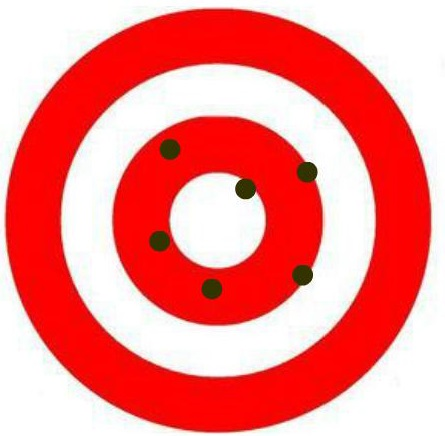

- How experiments try to establish causation
    - time order is built in independent variable leads to the dependent variable
    - eliminating other causes
    - randomly assigned

----------

# Lecture 02: Behavioural Neuroscience I

## The Nervous System and the Brain - The Big Picture

- Neuron
    - the basic cells that make up the nervous system
- Peripheral Nervous System
    - all the other nerves that run through the body which are not the brain or the spinal cord
- The Central Nervous System and the Brain
    - it is probably one of the frontiers that we understand the least of in psychology
- The Endocrine System
    - hormones
    - the different chemicals that float through the blood and also influence us
- Putting it all together - The Example of Hunger
    - not completely separate systems, all work together and influence each other
    - we can look at hunger as an example of how all these systems work together

## Neuron

### The Neuron

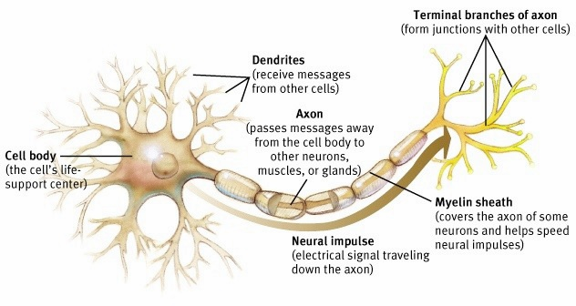]

- A neuron looks like above, structure includes:
    - Myelin Sheath:
        - globular part of the neuron which are **not found in the neurons of the brain**
        - lets the electric current bounce from node to node, so that the impulse can travel quickly
        - neurons which are part of the Peripheral System and part of the spinal cord, actually work **faster than in the brain**
    - Dendrites
        - are found at the back end of the neuron (Terminal Branches of axon is the front end of a neuron)
    - Cell Body
        - the cell's life-support centre

- How do you take a piece of tissue, like a cell or a neuron, and have it conduct electricity?
    - Study of Sea Slugs

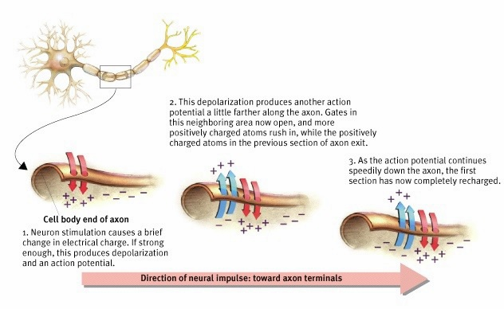
- How impulses travel down the Neuron
    - movement of ions in and out of the cell membrane is what creates the electricity and causes it to flow down the neuron (toward axon terminals)

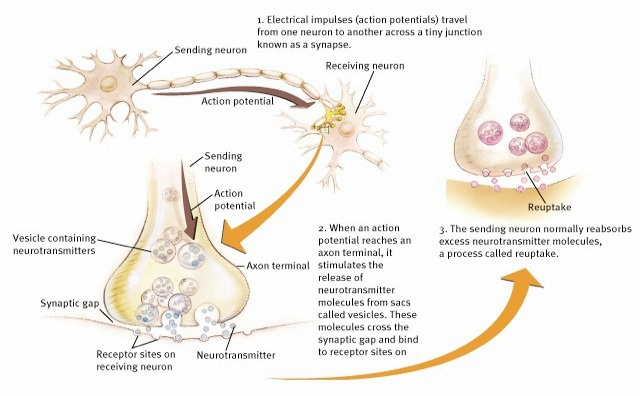
- Synapse:
    - to simplify the process:
        - the action potential breaks down the vesicle containing neurotransmitters in axon terminal
        - then the neurotransmitters go through the synaptic gap
        - and it changes the ions in the next neuron
        - after it goes through, the neuron has to reuptake, in order for the transmitter can be used again, in a really short period of time
    - but it is not that simple because:
        - each neuron is connected from and to multiple other neurons
        - it's a very complex combination of a whole bunch of synapses coming together at once to determine whether the next one fires
        - i.e. some makes the next neuron firing, some makes the next neuron stop firing

### Neurotransmitters

- Dopamine
    - very common especially in the brain
    - Parkinson's Disease
        - part of the cause is a deficiency of dopamine
        - marked by tremors
        - very important in the coordination of movement
    - also important in attention and emotion
    - Schizophrenia
        - marked by an excess of dopamine in various parts of the brain

- Serotonin
    - involved in mood, hunger, sleep and arousal
    - it affects things widely in the brain
    - a deficiency of serotonin is a cause for insomnia
    - deficiencies are also associated with depression

- Norepinephrine
    - more related to alertness and arousal
    - also associated with depression

- Acetylcholine
    - the most common neurotransmitter
    - involved in muscle movement
    - Alzheimer's Disease
        - the neurons that work through acetylcholine get ruined with Alzheimer's
    - also involved in learning and memory

- Endorphins
    - involved in pain regulation
    - when injured, the body naturally releases these endorphins which allow you to handle a lot more pain
    - heroine and morphine mimic this neurotransmitter

### How Drugs Affect Neurotransmitters

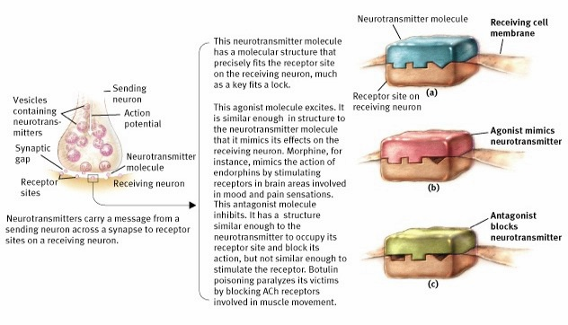

- Here is a picture showing the synapse:
    - at the synapse gap, neurotransmitters come across have complex shapes
    - on the other side of dendrites, receptor sites with complex shape that neurotransmitters fitting in
    - when it fits in, it changes the receiving cell membrane, and starts/stops the impulse depends on the type of neurotransmitter
- Drugs mimics the shape of neurotransmitter, 2 ways for drugs to work:
    1. **Agonist**: by acting just like the neurotransmitter, and in effect making It think that there is more of it; good if there is a deficiency of neurotransmitters
    2. **Antagonist**: others act like blockers and keep the neurotransmitter from having as much of an effect; good if there is too much of a neurotransmitter

## Divisions of the Nervous System

- Nervous System
    - Peripheral
        - Autonomic (controls self-regulated action of internal organs and glands)
            - Sympathetic (arousing): gets you ready for fight or flight
            - Parasympathetic (calming): lets you build up all your energy
        - Somatic (controls voluntary movements of skeletal muscles)
    - Central (brain and spinal cord)

### The Peripheral Nervous System

- Somatic Nervous System
    - controls voluntary muscles and their movement

- Autonomic Nervous System
    - controls the glands
    - controls the muscles related to our organs
    - although possible to override by conscious thought, for the most part these reactions occur spontaneously

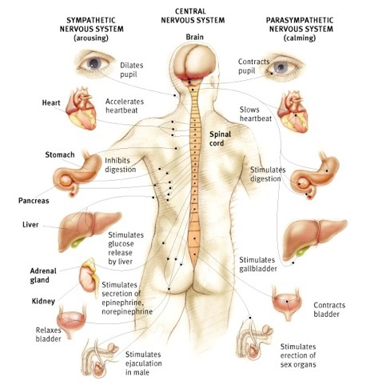

|     Organ     |                     Sympathetic                     |          Parasympathetic          |
|     :---:     |                        :---:                        |               :---:               |
| Eyeball       | Dilates pupil                                       | Contracts pupil                   |
| Heart         | Accelerates heartbeat                               | Slows heartbeat                   |
| Stomach       | Inhibits digestion                                  | Stimulates digestion              |
| Liver         | Stimulates glucose release by liver                 | Stimulates gallbladder            |
| Adrenal gland | Stimulates secretion of epinephrine, norepinephrine | -                                 |
| Kidney        | Relaxes bladder                                     | Contracts bladder                 |
| Penis (male)  | Stimulates ejaculation                              | Stimulates erection of sex organs |

### The Central Nervous System

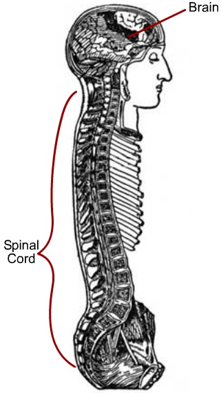

- The Spinal Cord
    - carries information from the Peripheral Nervous system up to the brain
    - does some 'thinking', in that it controls some responses
    - these responses are typically referred to as reflexes
    - type of neurons that cannot only transmit things, but can route things different ways; almost makes some primitive types of decisions
- The Brain
    - does almost all the processing other than the simple reflexes
- Three areas of the brain you need to know about

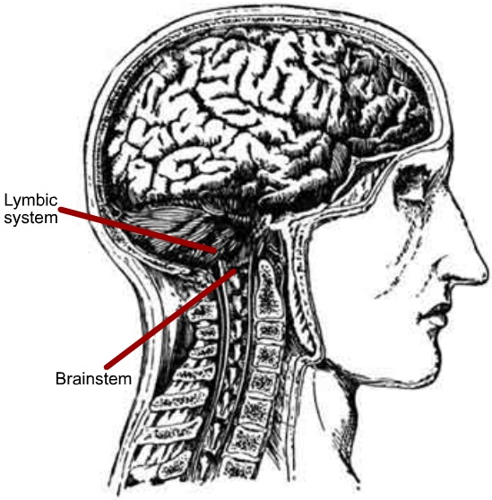

1. Brainstem
    - it is injury to the brainstem that usually kills
    - controls all the vital functions
    - very crucial even though it is only a small part of the brain
2. Lymbic system
    - controls motivation and emotion
    - very important for memory
3. Cerebral Cortex
    - separates us from animals

### How the Spinal Cord Controls Reflexes

A Simple Reflex:

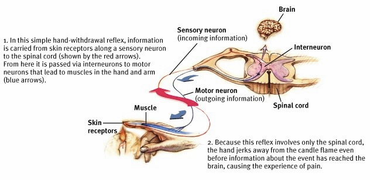

1. In this simple hand-withdrawal reflex, information  is carried from skin receptors along a sensory neuron to the spinal cord (shown by the red arrows). From here it is passed via interneurons to motor neurons that lead to muscles in the hand and arm (blue arrows). 
2. Because this reflex involves only the spinal cord, the hand jerks away from the candle flame even before information about the event has reached the brain, causing the experience of pain. 

### The Brain

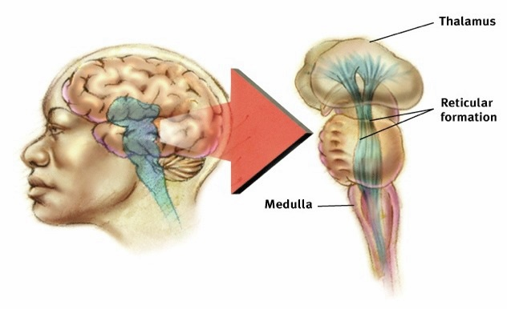

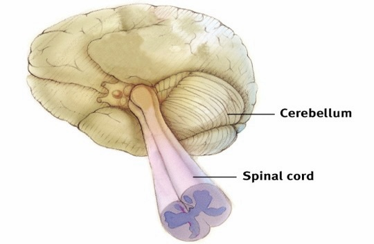

- The Four Parts of the Brain Stem
    - Medulla
        - absolutely critical in keeping us alive
        - controls the **heartbeat and breathing**
        - when someone break their neck, the Medulla get damaged and he's probably dead
    - Reticular formation
        - controls **attention, alertness, and reactivity**
        - can be thought of as the **accelerator of the brain**
        - basic function that regulates the overall amount of brain activity
    - Thalamus
        - sensory switching point
        - crucial for **vision and other senses**
        - beginning processes of our senses come about

- Cerebellum
    - crucial for **movement and coordination of movement**
    - crucial for **balance**

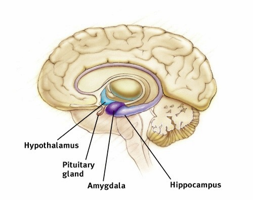
- The Lymbic System
    - Pituitary gland
        - important in the production of many necessary **hormones**
    - Hypothalamus
        - crucial for **hunger**
        - controls the hormones of the Pituitary gland
        - some influence on other emotions as well, particularly **pleasure**
    - Amygdala
        - important for a number of things, including **anger**
    - Hippocampus
        - crucial for memory and for laying down the functions of **memory**
        - damage can cause severe types of memory disorders

- The Cerebral Cortex - Basic Divisions
    - Occipital lobe
        - heavily involved in **vision**
    - Parietal lobe
        - involved in **language and spacial recognition**
    - Temporal lobe
        - involved in **hearing, memory and mood**
        - important in some of the functions of the Hippocampus and the Lymbic system
    - Frontal lobe
        - important in **reasoning and thinking**
        - involved in the **complex processing of information**

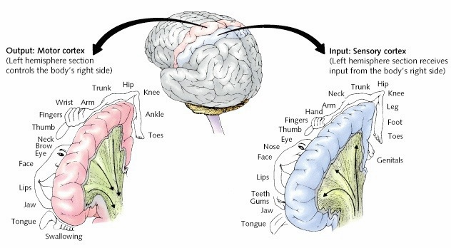

- The Cerebral Cortex Functional Divisions - Movement and Sense of Touch
    - Output: Motor Cortex
    - Input: Sensory Cortex
    - Note that the **left** hemisphere section receives/controls **right** side of body
    - the brain has no actual sensors for pain
    - there is a lot of specificity with the sensory and motor cortex
    - seizures occur when there is too much electrical activity in the motor cortex
    - motor cortex sends off charges to make movement throughout the body
    - in the case of a stroke, the motor cortex is damaged, and whatever is damaged is what will be paralyzed
    - often the stroke is only on one side of the brain, causing only one side of the body to be paralyzed
    - some people cannot move a part of their body, but can feel it
    - other people can move a part of their body, but cannot feel it as a result of damage in the Sensory cortex, which did not affect the corresponding part of the Motor cortex

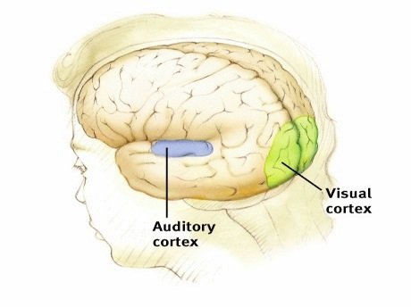

- The Cerebral Cortex Functional Divisions - Hearing and Visions
    - Vision cortex
        - initially the sensory information comes in through the eyes, but it is processed by the Visual cortex at the back of the brain
    - Hearing cortex
        - processed near the sensor (ear)
        - damage to this area can cause deafness with no possibility of correction

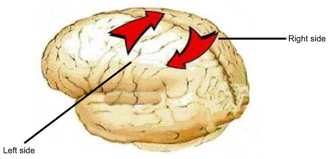

- The Cerebral Cortex Functional Divisions - Left and Right Sides of the Brain: thick area between the two brains for exchanging information
    - Corpus Callosum
        - think area between the two brains for exchanging information
    - Epileptic Study: 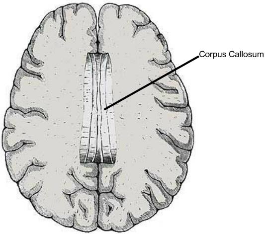
        - in the 1950s there was not much that they could do to help epileptics with their seizures
        - in order to stop the seizures they severed the corpus callosum; they cut the two sides of the brain apart
        - helps to reduce the number of seizures dramatically because the electrical impulses do not spread to the other side
        - this led to a new understanding of the brain
        - what was discovered was that the two sides of the brain actually perform different functions
        - left side in particular is more verbal; able to produce language in most people
        - right side is better at visual processing and coordinating; can understand simple language
        - some left-handed people have a brain structured like a right-hander, others have it reversed

- Mike Gazanaga Study
    - helps to explain the 'executive' function of the left brain, the ability to explain and interpret what is going on
    - brain is able to do this even when it is wrong
    - right brain can process visual stimuli, and can process commands
    - when he would flash "Get up" to the right side of the brain, a number of people would get up
    - their left brain was unaware of why they were getting up because it has no access to that information
    - everyone of them could instantaneously come up with an explanation as to why they stood up
    - left side of the brain is very good at rationalizing your own behaviour
    - Would the right side of the brain be better at picking up what emotion is being shown on a face?
        - still works to be done, no one knows...

## The Endocrine System

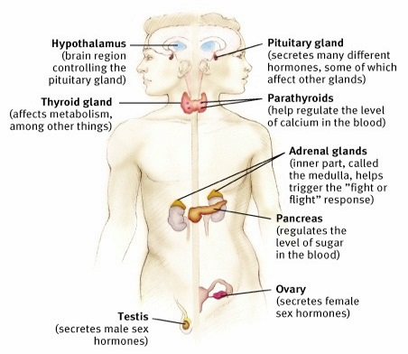

- **Pituitary gland**: secretes many different hormones, some of Which affect other glands
- **Hypothalamus**: brain region controlling the pituitary gland
- **Testes**: secrets male sex hormones
- **Ovaries**: secretes female sex hormones
- **Adrenal glands**: inner part, called the medulla helps trigger the "fight or flight" response
- **Pancreas**: regulates the level of sugar in the blood
- **Parathyroids**: help regulate the level of calcium In the blood
- **Thyroid gland**: affects metabolism, among other things

## Putting It All Together - The Case of Hunger

- When we don't eat for a while, what makes us feel hungry?
    - stomach contractions carry hunger signal through the peripheral nervous system to the hypothalamus
    - blood sugar levels as interpreted and controlled by the liver and pancreas send message to the hypothalamus
    - **lateral hypothalamus** is stimulated and releases the hormone orexin which heightens hunger, like the following picture

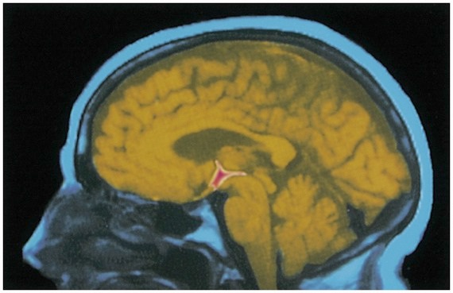

- When we eat, what makes us no longer feel hungry?
    - stomach expands and this message is transmitted to the hypothalamus
    - blood sugar levels as interpreted and controlled by the liver and pancreas send message of higher levels to the hypothalamus
    - insulin is also released
    - **ventromedial hypothalamus** is stimulated and which leads to the feeling of satiation and helps stop the eating

- Damage to the Hypothalamus
    - if there is a lesion to the lateral hypothalamus then rats basically starve themselves to death and virtually eat nothing
    - also seem lethargic and depressed
    - if the ventromedial hypothalamus is damaged, then rats basically will never stop eating and they get very fat

## Overarching Principles

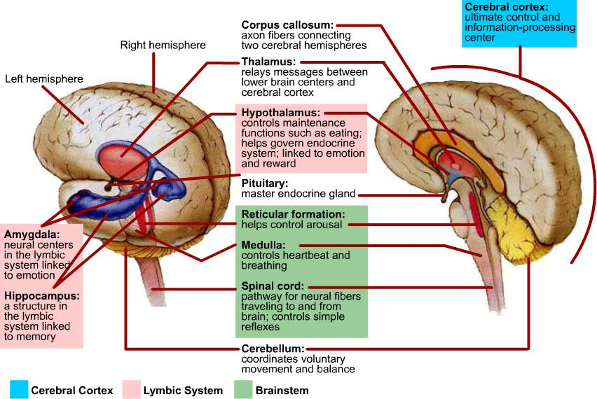

- Structures of the brain and the various systems work together in coordinated, overlapping, and redundant systems
- It incorrect to say one part is completely controlling something - that is way too simplistic
- Despite all this specificity and complexity the brain has quite a bit of plasticity
    - if an area is damaged other areas can take over
    - particularly true for young children

----------

# Lecture 03: Behavioural Neuroscience II

## The Senses
### Vision
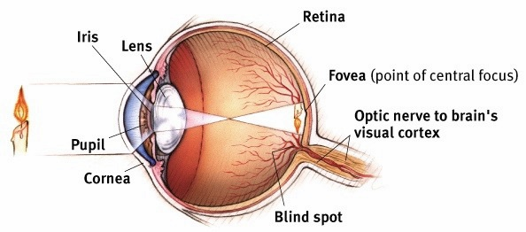

- Structure of eye
    - **Iris**: how much the light gets in
    - **Pupil**: just a hole
    - **Cornea**: protective surface
    - **Lens**: right behind the pupil, focuses the light race on the Retina(it revert the image)
    - **Retina**: flashed on it upside down
    - **Fovea**: actual spot on Retina, right behind the pupil, center of our vision, sensitive to colour
    - **Optic nerve** (to brain's visual cortex): take signal from retina and transmit it to brain

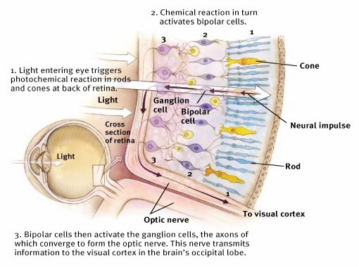
- Retina
    - How Retina processes the light:
        1. Light entering eye triggers photochemical reaction in rods and cones at back of retina
        2. Chemical reaction in turn activates bipolar cells
        3. Bipolar cells then active the ganglion cells, the axons of which converge to form the optic nerve. This nerve transmits information to the visual cortex in the brain's occipital lobe.
    - 3 types of cells involves in the procedure:
        1. Ganglion cell
        2. Bipolar cell
        3. Sensors
            - Rod: _responsible for black and white vision_
            - Cone: _responsible for colour vision_

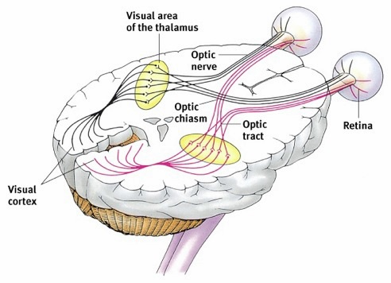

- From the Eye to the Cortex
    - the part of the brain that helps to understand things is the cortex
    - visual cortex takes the light that is coming in, and turns it into shapes

- Feature Detection
    - How can you tell that a table is square?
    - in the cortex individual cells respond to lines at various angles
    - take the symbols of lines and create a pattern
    - cells converge to create our perception of what we see
    - higher level cells provide even more perception
    - all of this happens virtually instantaneously
    - this all is done with massive parallel processing of information
    - it is still not completely understood as to how the visual cortex organizes all this information

- Colour Vision
    - Young-Helmholtz Trichromatic Theory
        - theory comes primarily from studying the retina
        - three types of cones in the retina, which respond to three types of light
        - primary colors: red, green, blue
        - all other colours can be made from these three
        - could just the specificity of the cones produce these different colours?
        - consistent with this theory are colour-blind individuals
            - red and green - problem with either green or red cones
            - blue and green - no distinction between blue and green cones
        - theory works well untill we talk about the colour yellow
            - brain responds to yellow as a primary colour
    - Opponent-Process Theory
        - there are actually three sets of opposing pairs of colours
        - 3 opponent color pairs
            - black/white
            - red/green
            - blue/yellow
        - explains **afterimage effect**
            - Why do you get those opposing colours?
            - when staring at the colours, the neurons associated with those colours will fire, but they will eventually wear out
            - the lack of firing is now interpreted as if the red, blue and white are firing thus creating the afterimage effect
            - after image effect is when the brain thinks that the reverse colours are firing
    - Both theory are probably true
        - at the retinal level, you have the three types of cones which work together to produce all the different colours
        - true in the thalamus, higher up in the brain as it is processing things

### Hearing

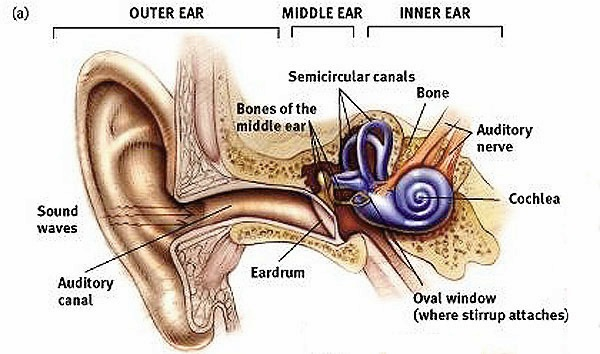

- The Parts of the ear
    - **Outer ear**: Pinna and part of auditory canal
    - **Auditory canal**
    - **Eardrum**: begin of actual signal, it vibrates
    - **Bones of the middle ear**: 3 bones, transmitted mechanically
    - **Oval window**: where stirrup attaches
    - **Cochlea**: like seashell, turns physical stimulus into neural impulses
    - **Semicircular canals**: important to balance
    - **Vestibular sacs**: have nothing to do with hearing
    - **Auditory nerve**

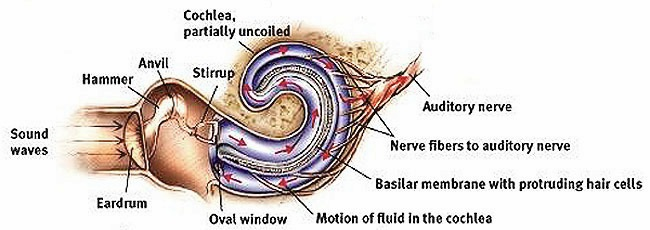

- A Closer Look at the Cochlea
    - sound comes in and make eardrum vibrate
    - the vibrations move the hammer, anvil and stirrup which push against fluid inside the cochlea
    - wave get flushing in the cochlea
    - cochlear membrane (basilar) with protruding hair cells, the waves bend the hairs
    - the bending of the hairs starts the nerve impulse that really allows you to hear

- How does this cochlear fluid get turned in to a neural impulse? Pitch perception
    - Place theory
        - the particular hairs in the cochlear membrane which get bent over by the wave, will determine what type of pitch there will be
        - big waves are going to hit back a lot further creating one pitch which will be low sounds; low sounds make bigger waves
        - higher sounds are going to make littler waves, which lands closer in, creating high pitch sound
        - this theory can't explain the high sounds that we are capable of hearing
    - Frequency Theory
        - it is the speed of the waves in the cochlea that determines the pitch
        - big waves go slower, and little waves go faster
    - Both theories seem to be true
        - Place theory works well for high sounds, and it is the particular hairs that matter
        - Frequency theory explains low sounds, it is the frequency of the waves

### The Other Senses: Taste, Smell, Touch, Pain, and Balance

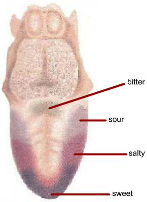

- Taste
    - four basic tastes - **sweet**, **sour**, **salty** and **bitter**
    - tongue has tastebuds that respond to these different tastes
    - taste sensations are created by **chemical reactions** on the tastebuds
    - heavily influenced by smell
    - together they respond to much of the same stimuli - this is called **sensory interaction**
    - often what enhances the flavour of food is the smell rather than the particular combination of sweet, salty, sour and bitter

- Smell
    - occurs due to a chemical reaction in the olfactory membrane that creates smell
    - we still do not understand exactly how receptors in the olfactory membrane work
    - chemical that is in the air gets picked up by these receptors in the olfactory membrane which creates a neural impulse to the brain
    - odors can powerfully evoke memories and emotions

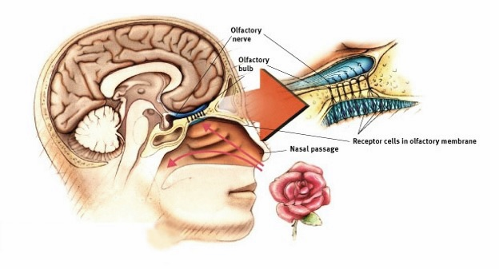

- Structure of smell sensor:
    - **Nasal passage**: sense smell
    - **Receptor cells in the olfactory membrane**: some chemical reactions occurs here
    - **Olfactory nerve**: set up impulse to the brain
    - **Olfactory bulb**: pick up impulse situated, where occur in lymbic system, actually closely related with it, and that's maybe why order cause strong memories, because it is close to Hippocampus, which is crucial to memory, also lymbic system is also crucial to emotional reactions (Amygdala)

- Touch
    - organ for touch is **skin**
    - there are specialized nerve endings in the skin, but these do not seem to have a relationship with what we feel
    - our skin is sensitive to **pressure**, **warmth** (not hot), **cold**, and **pain**
    - these four sensitivities give rise to quite varied sensations
    - it is interesting that with that the brain has such an influence on that sense of touch when it doesn't on so many other sensations
    - hot = warm + cold, an interesting physical illusion
    - wet = cold + pressure
    - feeling itchy comes from overstimulated pain receptors

- Pain
    - more is known about pain, but the more that is known, the more difficult it is to understand
    - there is no definable area of the brain that is related to pain
    - what we tend to remember about the pain is the **height** of the pain, not the duration
    - Gate Control Theory
        - suggests that the spinal cord has a neurological gate that either blocks pain signals or allows them to travel to the brain
        - distractions can close the gate
        - brain is blocking out the pain response with lots of other responses
        - endorphins, which are the body's natural pain killers, may shut the gate right at the spinal cord so that pain can't travel to the brain

- Balance
    - feeling of be disoriented or dizzy - kinesthetic sense
    - seems to occur through two very different sense organs
    - the joints and muscles tell us the position of our body
    - also the semi-circular canals in the ears tell us the vestibular sense or the position of our head
    - it is those grains hitting the hairs that gives us this sense of balance and orientation, particularly for the head 

## Focus on University of Waterloo Research – Synaesthesia

- Synaesthesia
    - blending of sensory perception; blending of sensations
    - Digit-colour synaesthesia
        - a particular colour is projected onto a number
        - individuals have different colour ranges for the numbers
    - nobody really knows how this develops, in fact it is a very rare condition
    - researchers at the University of Waterloo have only identified 80-90 people in the world

## Coordination of Language in the Brain

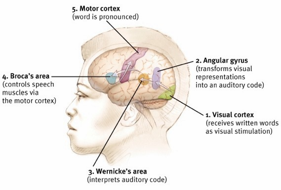

- How do we read out load?
    - Visual cortex: _receives written words as visual stimulation_
    - Angular gyrus: _transforms visual representations into an auditory code_
    - Wernicke's area: _interprets auditory code_
        - stroke on this area: can produce speech but none of it makes any sense; affects the interpretation of speech
    - Broca's area: _controls speech muscles via the motor cortex_
        - stroke on this area: can understand speech, but have a hard time producing speech
    - Motor cortex: _word is pronounced_

## Brain Coordination While We Sleep

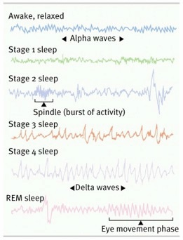

- The Active Sleeping Brain
    - activity in our brain is remarkably varied while we sleep
    - five stages of sleep defined by brain activity that occur when we sleep
        - **Awake**, relaxed: Alpha waves
        - **Stage 1 sleep**: lightly sleep
        - **Stage 2 sleep**: little peaks, called _Spindle_ (burst of activity)
        - **Stage 3 sleep**: bigger waves and higher amplitude
        - **Stage 4 sleep**: really high amplitude (waves are called _Delta waves_)
        - **REM sleep**: REM stands for _rapid eye movement_, happens when dreaming

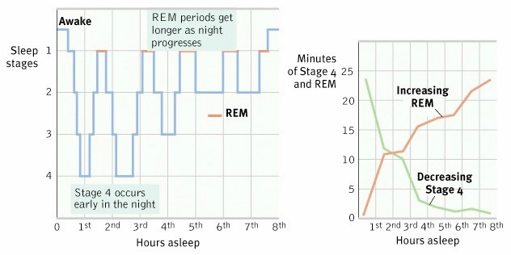

- The Sleep Cycle
    - Awake to deeper and deeper stages of sleep
    - Then REM sleep
    - more Stage 4 in first 2-3 hours, more REM afterwards

- Why do we sleep
    - when we don't sleep we feel terrible
    - why do we spend roughly a third of our lives sleeping?
    - when people don't sleep they are not alert and are more likely to get into accidents
    - but this doesn't answer why we need to sleep

- Why do we dream?
    - Freud
        - believed that dreams produced wish fulfillment
        - thought that we worked out all of our fantasies through our dreams
        - interpreted sex and violence into any type of dream
    - Modern Theory
        - Activation-synthesis
        - dreams result from random neural activity in the head which the brain attempts to make sense of
        - whatever pathways or connections that have been activated during the day, the more likely to be activated again at night, particularly when dreaming
        - need dreams for memory consolidation and cognitive development

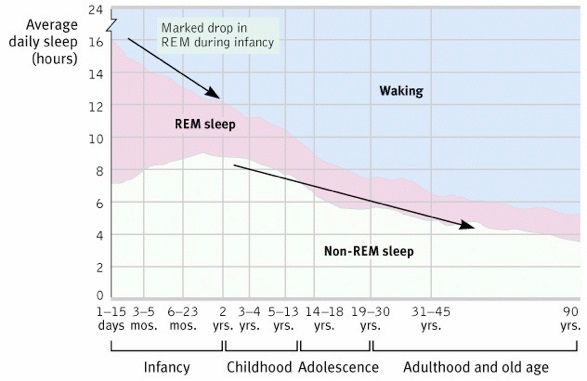

- Sleep Throughout the Lifetime
    - as you get old, you spend most of your time awake
    - when you are younger, you spend more time to sleep, especially when you are a baby, you take lot of time dreaming, why?
        - the connections that are developing need to be reinforced, dreams foster this sort of cognitive development
        - dreaming facilitates learning

# Lecture 04: Developmental Psychology I

## What is Behaviourism?

- Classical Conditioning 
    - Pavlov and his dogs 
- Operant Conditioning 
    - Skinner and his pigeons 
- Language Acquisition 
    - How is it that we learn to speak? 
- Observational Learning 
    - the Bobo Doll 

## Classical Conditioning

- Pavlov and his dogs 
    - had test tubes hocked up to saliva glands Of dogs to collect the spit 
    - noticed after a few days of giving them food, that every time he walked up to the dogs to give them food, the saliva would start to flow 
    - the question became, _Why were they salivating before the food was given to them?_

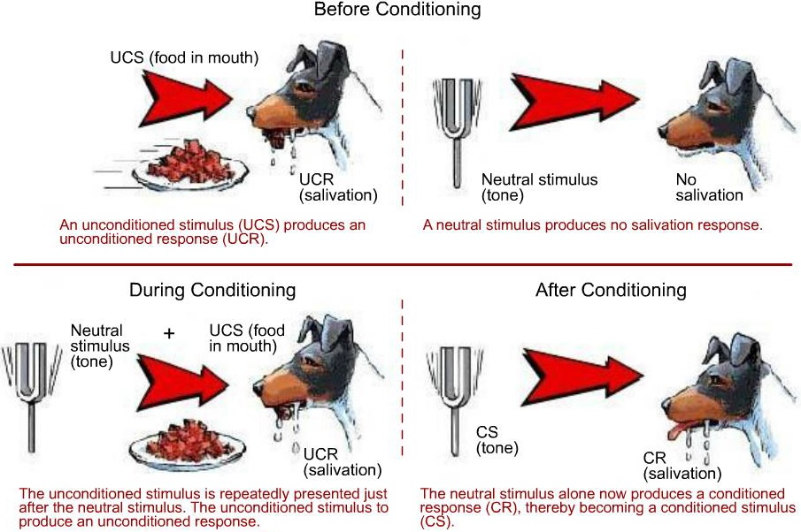

- Procedure:
    - **An unconditioned stimulus (UCS) produces an unconditioned response**: Introduce food, and dog starts salivation
    - **A neutral stimulus produces no salivation response**: use metronome, no salivation
    - **The UCS is repeatedly presented just after neutral stimulus. The UCS to produce an unconditioned response**: let the dog think the food is associate with metronome by repeatedly let the dog hear metronome when show it the food
    - **The neutral stimulus alone now produces a conditioned response (CR), thereby becoming a conditioned stimulus (CS)**: now let the dog hear metronome again then the dog starts salivation

- What is learning and unlearning? 
    - In Classical conditioning, learning is the association Of a conditioned stimulus or neutral stimulus With an  unconditioned stimulus to the extent that the conditioned stimulus produces the unconditioned response 
    - Pavlov didn't understand the implications of this very well: he did not realize what learning could come from this 
    - John Watson 
        - one of the early American behaviourists 
        - not going to study thoughts, but will study what is observable
        - uses Pavlovian principles to teach 
        - "You give me twenty children, and I can turn them into anything!" 
        - Little Albert was taught to be terrified of anything that is soft and furry 
        - the idea was that you could teach something to someone which did not make any sense, and they could learn to be afraid of it 
        - in some ways this is a model for phobia

- Process of Generalization 
    - occurs **when the conditioned stimulus is changed slightly, and the conditioned response still happens**
    - screaming and crying is the conditioned response, it is something that can be observed

- Discrimination 
    - occurs **when the conditioned stimulus is changed, and the conditioned response doesn't happen**
    - starting to get unlearning 
    - this would happen if Little Albert was afraid of rats, but not bunnies, and could make the distinction between them 
    - can teach this process by only presenting the unconditioned stimulus with the rat and never with the bunny 

- Extinction 
    - occurs **when the conditioned stimulus, now the unconditioned response, no longer produces the response**
    - according to the theory, extinction should happen eventually if the unconditioned stimuli is no longer paired with the conditioned stimuli 

- Problems with Classical Conditioning 
    - the only behaviour that can be affected is one that the organism, the dog or Little Albert, would normally do
    - you cannot get the organism to do new behaviours 

## Operant Conditioning

- what operant conditioning allows for, and allows to happen, is behaviours that **would not naturally occur** 
- Skinner proposed that **any behaviour that anyone engages in has been learnt through operant conditioning**

- What is Operant Conditioning? 
How does an organism learn to do this it doesn't normally do? How do you ever get behaviour that doesn't occur as an unconditional response (UCR)? 
    - Skinner proposed that behaviour that is rewarded will occur more often in the future 
    - behaviour that is not rewarded will occur less often 
    - according to Skinner, almost all behaviour is shaped in this way 
    - what Skinner argued, and very conclusively demonstrated, was that **complex behaviours can be shaped through rewards**

- What is Operant Conditioning? 
    - Skinner and his pigeons 
        - by rewarding pigeons with food for doing behaviours which he wanted them to do, he could teach them to do miraculous things 
        - playing Beethoven is a very complex behaviour and is not something that pigeons do naturally 
        - learning is the acquisition of new behaviours 

- Types of Reinforcers 
    - **Positive reinforcer**: getting good things 
    - **Negative reinforcer**: removing bad things (also a good thing)
    - both positive and negative reinforcers actually promote behaviours, make them more likely to occur 
    - note that a negative reinforcer is **not** a punishment 
        - Skinner thought punishment was a bad way to teach 
        - when things happen that are perceived as bad, or when good things are removed, you don't know what to do 
        - punishment often leads to **inaction** rather than action; learning should be about producing actions 
        - rather than acquiring new behaviours, it lead to the shutting down of behaviour 
    - **Primary reinforcers**: pleasant in their own right 
    - **Conditioned (secondary) reinforcers**: pleasant through association (like money)
        - note here that this builds on classical conditioning 
        - associated the conditioned stimuli (money) with the unconditioned stimuli (what the money can buy that is pleasant in its own right) 

- One thing in common with classical conditioning and operant conditioning 
    - both argue that to understand behaviour and where it comes from, you don't need to know anything about what is inside the head (the big black box)
    - thoughts are epiphenomenon; things that are there but which have no importance or influence 
    - all you need to know is what can be observed 
    - any behaviour can be explained without looking at though 

## Language Acquisition

- Was language something that was learned through behaviourism? 
    - Skinner argued that language was learnt through reinforcement 
    - basic idea is that children receive all kinds of reinforcement and affection from their parents when they first begin to "babble", which carries on as the child begins to use words and sentences 

- Chomsky 
    - believed that **language learning was innate, that there is an inborn ability to learn language**
    - there is a critical period early on in which everyone learns language 
    - Chomsky was a linguist, not a psychologist 
    - argued that Skinner was naive in thinking that parents could teach their children to talk simply through the use of reinforcement 

- The Bottom Line 
    - behaviourism is clearly wrong in this debate
    - children learn language incredibly fast 
    - babies can actually hear all the different ranges of sound that people make 
    - after about a year, children's brains become used to the language that they hear, and can no longer hear certain sounds 
    - children can learn thousands of words a day and can pick up a foreign language without any effort 
    - all of this suggests that they are not learning by reinforcement but that there is a built-in ability to learn language 

## Observational Learning

- Bandura 
    - believed that **people did not have to learn through rewards or punishments, but could learn by watching others**
    - in order for this to happen one must have thoughts to intervene between what is going on 
    - it is not just a matter Of being rewarded, one must make an inference that the same thing could happen to themselves 

- The Bobo Doll Study 
    - the adult proceeded to "beat" the bobo doll up
    - what would the children play with? in particular, would they beat up the bobo doll?
        - the child who did not see the adult with the bobo doll, hit it an average of 2 times
        - those who did watch hit the doll an average of 62 times

- What did these children learn? 
    - according to Sandura, they learned how to be violent 
    - Bandura felt that this had some implications for the effects of violence on television, and in the movies, on children 
    - argued that children learn that it is good to be violent by watching people being rewarded for violent behaviour 
    - what it did was say to behaviourism that do matter 

## The Big Picture: The Fundamental Issues Being Addressed

- Big Difference between Nature vs Nurture 
    - behaviourists focused most on nurture 
    - Watson believed that he could take twenty children and turn them into anything 
    - Skinner believed that he could create a utopian society through behaviourist principles 
    - nature side of things, children have this inborn ability to learn language 

- Could Behaviourism explain what was really important? 
    - How applicable is the science of psychology to everyday life? 
    - Can it explain what really goes on? 
    - behaviourism could not explain how we learn by watching, nor could it explain how we learn language. 

- Is there still a role for behaviourism? 
    - behaviourism can still be used to control some behaviours 
